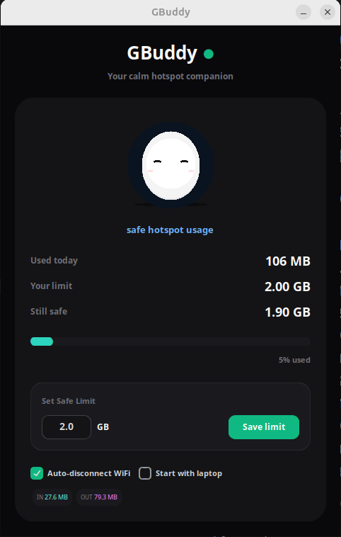

# GBuddy

GBuddy is a simple desktop app that helps you protect mobile hotspot data when sharing internet from your phone to your laptop.

It tracks how much data your laptop uses and lets you set a safe hotspot limit.

## Why GBuddy exists

When using mobile hotspot, data can disappear quickly. GBuddy helps you stay in control by showing:

- data used today
- your safe limit
- data left before warning
- internet coming in
- internet going out

## Features

- Simple one-screen interface
- Mobile hotspot usage tracking
- Custom safe GB limit
- Auto-disconnect WiFi option on Linux
- Clean dark UI
- App launcher support on Linux
- Built with Python and CustomTkinter

## Screenshot



## Run from source

```bash
git clone https://github.com/LukaKarchava/gbuddy.git
cd gbuddy
python3 -m venv venv
source venv/bin/activate
pip install -r requirements.txt
python main.py